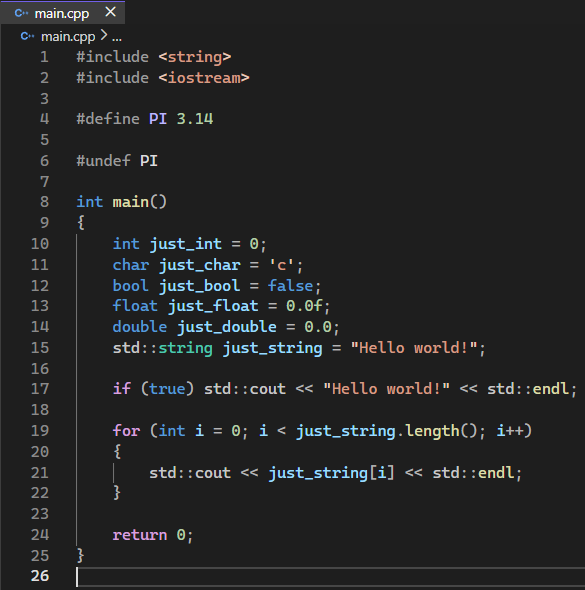

# Dark theme from Visual Studio 2022

This extension provides dark color theme inspired by Visual Studio 2022. It includes semantic highlighting.

For better experience you should install "Cascadia Mono" font [here](https://github.com/microsoft/cascadia-code).

### Supported languages

## Images

### Legal Notice
- This repository is not affiliated with Microsoft Corporation.
- Visual Studio and Visual Studio Code are trademarks of Microsoft Corporation.
